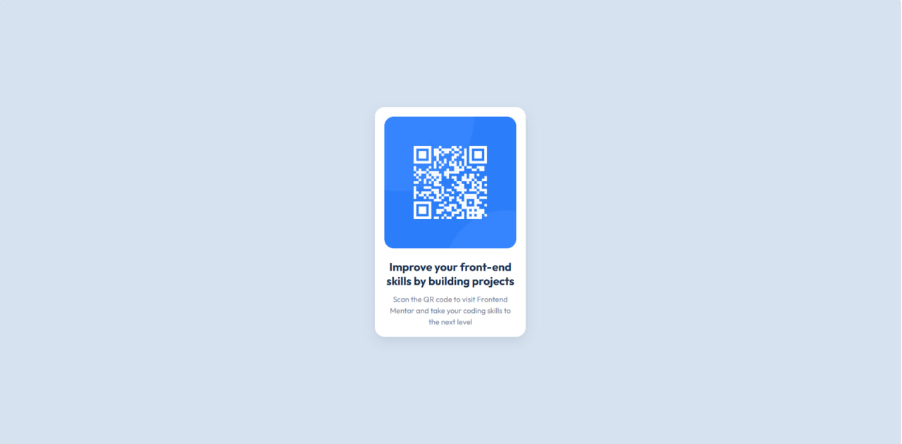
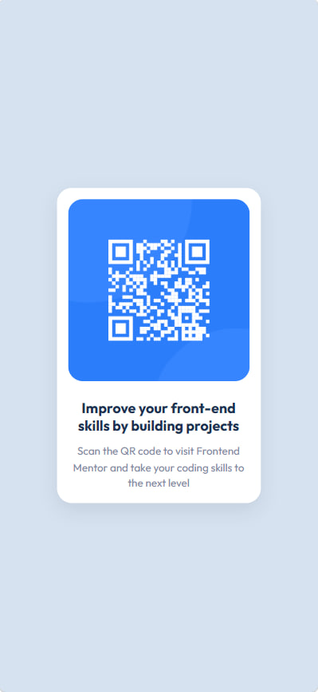

# Frontend Mentor - QR Code Component Solution

This is my solution to the QR Code Component challenge on Frontend Mentor. The goal of this project was to recreate a responsive QR code card based on the provided design while practicing modern HTML and CSS fundamentals.

## Table of Contents

* [Overview](#overview)

  * [Screenshot](#screenshot)
  * [Links](#links)
* [My Process](#my-process)

  * [Built With](#built-with)
  * [Features](#features)
  * [What I Learned](#what-i-learned)
  * [Continued Development](#continued-development)
  * [AI Collaboration](#ai-collaboration)
* [Author](#author)

## Overview

### Screenshot

 
 

### Links

* Live Site URL: [Add live site URL here]

### My Process

Before writing any code, I downloaded the starter files and carefully examined the design provided by Frontend Mentor.

I started by breaking the layout into logical sections:

* Card container
* QR code image
* Title
* Description text

After identifying the structure, I built the HTML markup using semantic elements and BEM naming conventions for better organization.

Once the HTML structure was complete, I focused on styling the component with CSS. I used Flexbox to center the card on the page and adjusted spacing, typography, colors, and shadows to match the design as closely as possible.

Finally, I tested the layout on smaller screen sizes and made responsive adjustments to ensure the component remained usable and visually consistent across devices.

### Built With

* Semantic HTML5
* CSS3
* Flexbox
* Responsive Design
* BEM Naming Convention
* Google Fonts (Outfit)

### Features

* Responsive QR code card component
* Mobile-friendly layout
* Semantic HTML structure
* Flexbox centering
* Clean and maintainable CSS
* BEM methodology for class naming

### What I Learned

This project helped me strengthen my understanding of HTML and CSS fundamentals.

During development I practiced:

* Creating semantic HTML structures
* Using Flexbox for layout and centering
* Working with spacing and typography
* Applying responsive design principles
* Organizing CSS using the BEM methodology
* Using `min-height: 100vh` for better page layouts

One example from the project:

```css
body {
  display: flex;
  justify-content: center;
  align-items: center;
  min-height: 100vh;
}
```

This approach allows the card to stay perfectly centered regardless of screen size.

### Continued Development

In future projects I want to continue improving:

* Responsive design techniques
* Media queries
* CSS architecture
* Accessibility (a11y)
* JavaScript fundamentals
* React development

My current goal is to complete more Frontend Mentor challenges and gradually build a strong front-end development portfolio.

### AI Collaboration

For this project, I used ChatGPT as a learning assistant rather than a code generator.

AI helped me:

* Understand HTML and CSS concepts
* Learn Flexbox and responsive design
* Improve CSS organization
* Better understand the BEM methodology
* Review my code and identify areas for improvement

The most valuable aspect was receiving explanations and feedback that helped me understand why certain solutions work instead of simply copying code.

## Author

* GitHub - [Mrac3k](https://github.com/Mrac3k)
* Frontend Mentor - [@Mrac3k](https://www.frontendmentor.io/profile/Mrac3k)

---

Built as part of my front-end development learning journey.
